# Assignment 2 — Dual Implementation of an Expense Approval Workflow

**Student:** Diniz Martins  
**Course:** CST8917 — Serverless Applications  
**Assignment:** Assignment 2 — Compare & Contrast  

---

## 1. Project Overview

This project implements the same expense approval workflow using two different Azure serverless orchestration approaches:

- **Version A:** Azure Durable Functions using the Python v2 programming model.
- **Version B:** Azure Logic Apps integrated with Azure Service Bus and an Azure Function for validation.

The objective was to implement the same business process twice and compare the practical differences between a code-first orchestration model and a visual/declarative orchestration model.

Each expense request contains:

- Employee name
- Employee email
- Amount
- Category
- Description
- Manager email

The following business rules are implemented:

1. All required fields must be provided.
2. The category must be one of: `travel`, `meals`, `supplies`, `equipment`, `software`, or `other`.
3. Expenses under $100 are automatically approved.
4. Expenses of $100 or more require manager approval.
5. If the manager does not respond before the configured timeout, the expense is automatically approved and marked as `escalated`.
6. The employee receives a notification containing the final outcome.

---

# 2. Version A — Azure Durable Functions

## 2.1 Architecture

Version A implements the workflow using Azure Durable Functions with the Python v2 programming model.

The implementation contains:

- HTTP client/start function
- Durable orchestrator
- Validation activity
- Expense processing activity
- Notification activity
- Manager decision HTTP endpoint
- Durable external event
- Durable timer for manager approval timeout

The orchestrator coordinates the complete lifecycle of each expense request.

For expenses below $100, the request is validated and automatically approved without requiring manager interaction.

For expenses of $100 or more, the orchestrator waits for either a manager decision received as an external event or expiration of a durable timer.

This implements the **Human Interaction pattern** using Durable Functions.

---

## 2.2 Design Decisions

I kept the business workflow inside the orchestrator while separating individual operations into activities.

Validation is performed by a separate activity so that validation logic remains independent from orchestration logic. Expense processing and notification are also implemented as activities.

For manager approval, the orchestrator waits for an external event. The manager decision HTTP endpoint sends that event to the appropriate orchestration instance.

The timeout is implemented using a durable timer rather than a normal Python delay. This allows Durable Functions to persist orchestration state while waiting instead of requiring a continuously running process.

---

## 2.3 Version A Test Evidence

### Scenario 1 — Valid Expense Under $100

An expense below $100 is automatically approved without manager interaction.

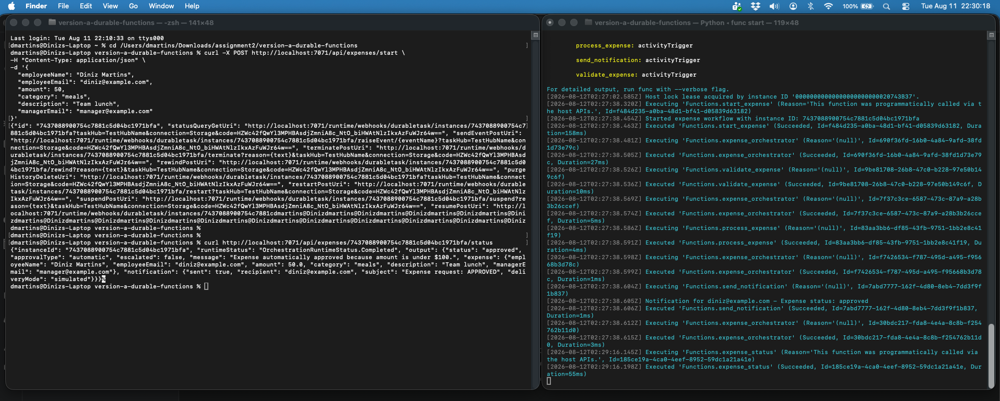

The completed orchestration returns an approved status and indicates that the approval type was automatic.

---

### Scenario 2 — Manager Approves Expense

For an expense of $100 or more, the workflow waits for manager interaction.

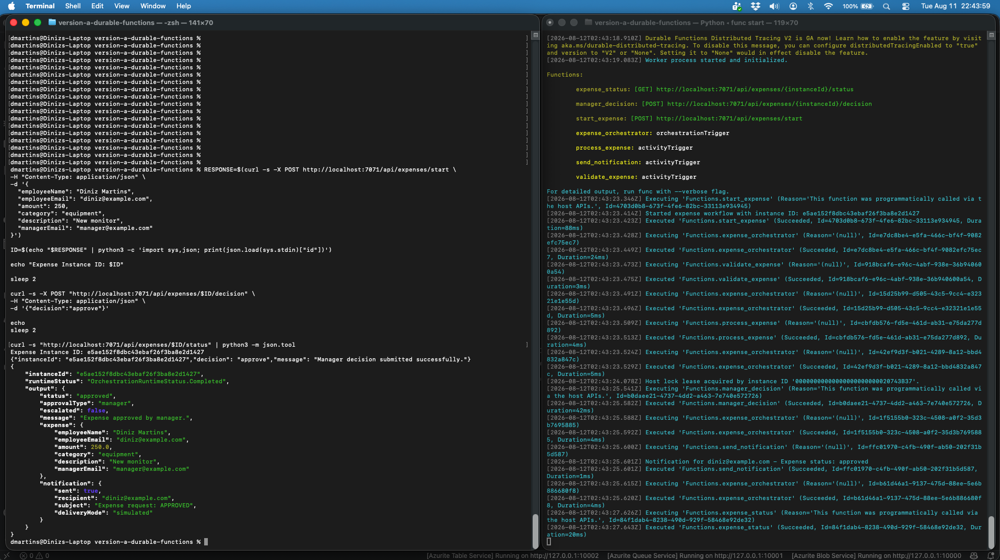

The manager decision is submitted through the HTTP decision endpoint. The orchestrator receives the external event and completes with an approved result.

---

### Scenario 3 — Manager Rejects Expense

The same Human Interaction mechanism supports rejection.

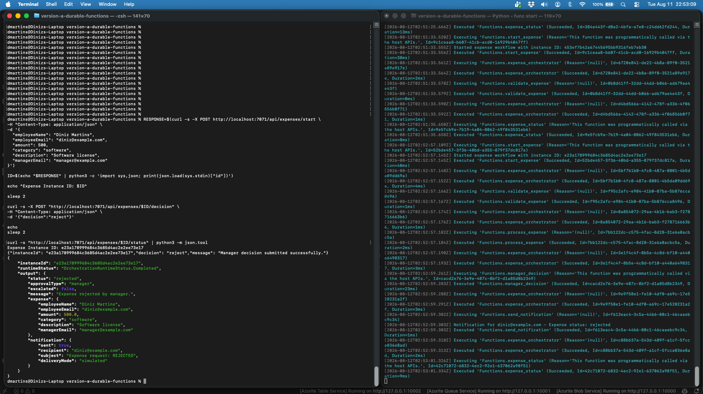

The manager submits a rejection and the orchestration completes with the `rejected` status.

---

### Scenario 4 — No Manager Response / Timeout

The Durable Functions orchestration can remain active while waiting for the manager response.

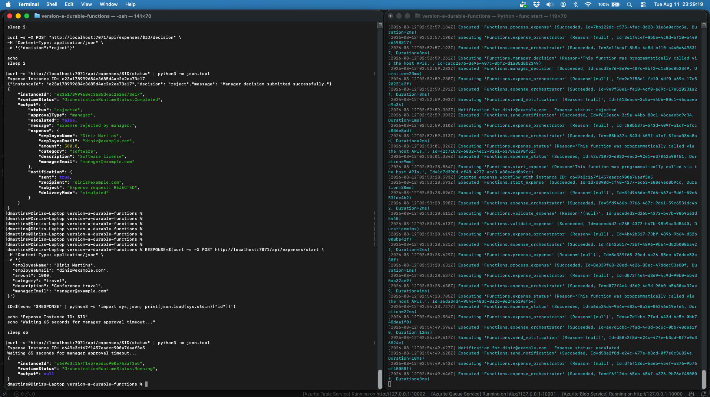

If no manager response arrives before the durable timer expires, the expense is automatically approved and flagged as escalated.

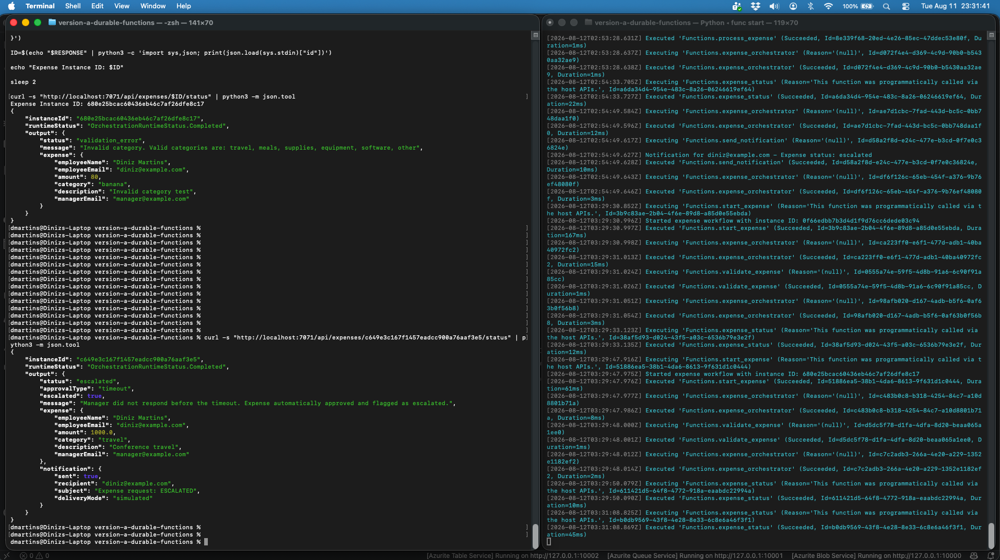

The final result contains the escalated status and demonstrates the required timeout behavior.

---

### Scenario 5 — Missing Required Field

The validation activity rejects requests that do not contain all required fields.

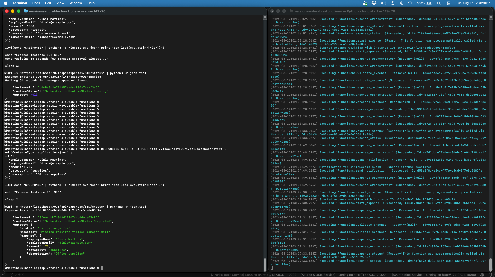

The test demonstrates that a request missing a required field is rejected before entering the approval process.

---

### Scenario 6 — Invalid Category

The validation activity verifies that the expense category is one of the allowed categories.

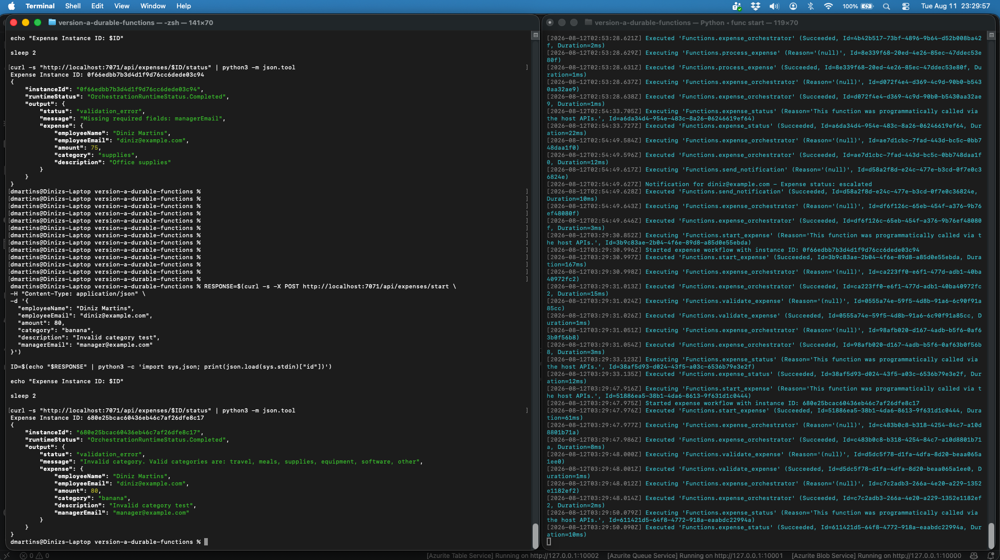

An unsupported category produces a validation error.

---

# 3. Version B — Azure Logic Apps + Service Bus

## 3.1 Architecture

Version B implements the same business workflow using a visual/declarative architecture based on Azure services.

The main components are:

- Azure Service Bus queue: `expense-requests`
- Azure Logic App
- Azure Function for expense validation
- Microsoft 365 email connector
- Azure Service Bus topic: `expense-outcomes`
- Filtered topic subscriptions for workflow outcomes

The Service Bus queue is used for incoming expense requests.

The Logic App receives the expense, parses the message, and calls the validation Azure Function. Conditions then determine whether the request should be automatically approved or sent to the manager.

Final workflow outcomes are published to the Service Bus topic.

---

## 3.2 Manager Approval Design

Logic Apps does not provide the Durable Functions Human Interaction pattern in exactly the same way.

For Version B, I implemented manager interaction using the Microsoft 365 **Send email with options** action.

For expenses of $100 or more, the manager receives an email containing **Approve** and **Reject** options.

The Logic App waits for the manager response.

For demonstration and testing purposes, the approval action uses a short timeout. If the manager does not respond before the timeout, a separate execution path handles the timeout as a valid business outcome.

The timeout path:

1. Publishes an `escalated` outcome to the Service Bus topic.
2. Sends an escalation notification to the employee.
3. Terminates the workflow successfully.

This prevents the expected manager timeout from leaving the complete business workflow in a failed state.

---

## 3.3 Version B Test Evidence

### Scenario 1 — Expense Under $100: Auto-Approved

An expense below $100 follows the automatic approval branch.

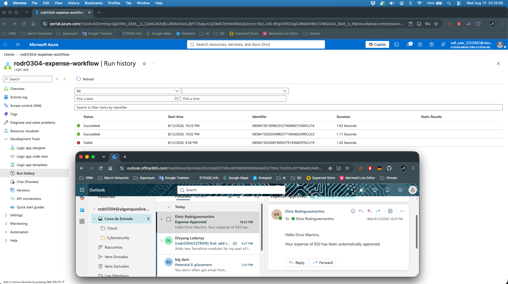

The employee receives an email confirming that the expense was automatically approved.

---

### Scenario 2 — Manager Approval Request

Expenses of $100 or more trigger manager interaction.

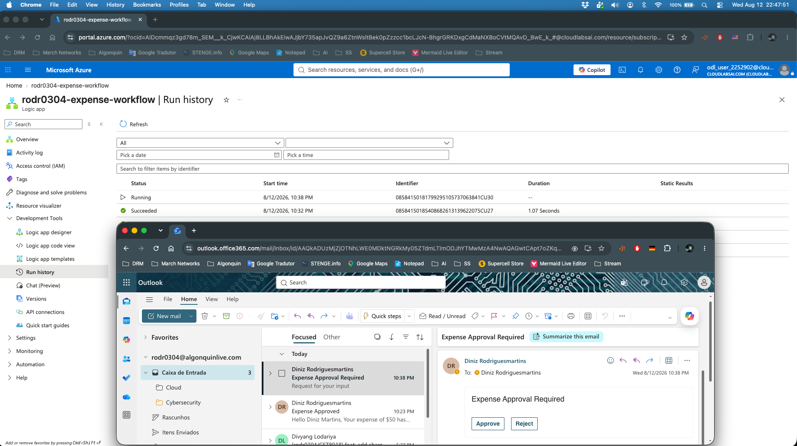

The email presents the manager with approval and rejection options.

Additional evidence of the interactive approval process:

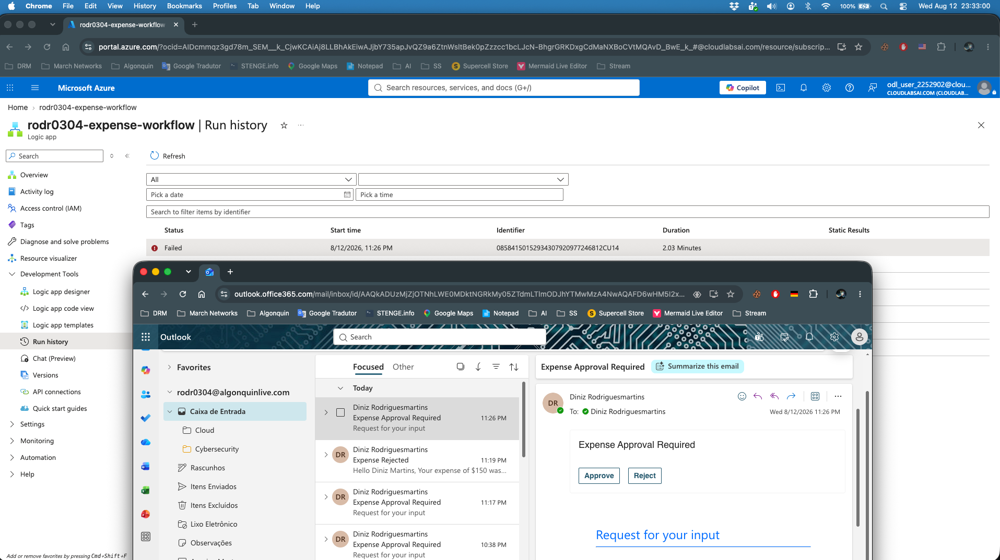

---

### Scenario 3 — Manager Approves Expense

When the manager selects **Approve**, the Logic App processes the approved outcome.

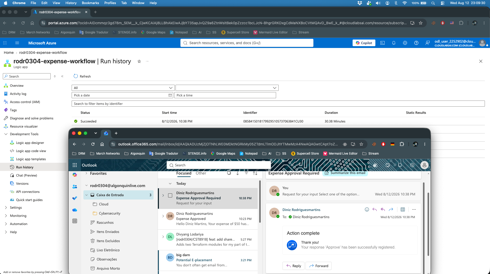

The workflow records the manager response and completes the approval path.

---

### Scenario 4 — Manager Rejects Expense

When the manager selects **Reject**, the Logic App follows the rejection branch.

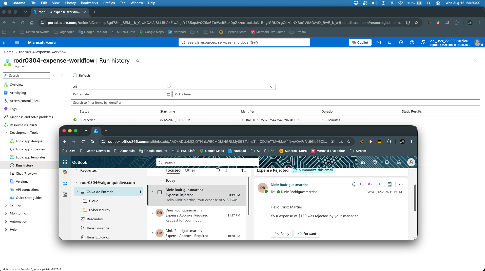

The employee receives an email confirming that the expense was rejected by the manager.

---

### Scenario 5 — Manager Approval Timeout / Escalation

If the manager does not respond before the configured timeout, the `Send email with options` action reaches the `TimedOut` state.

The timeout branch then publishes the escalated outcome to Service Bus.

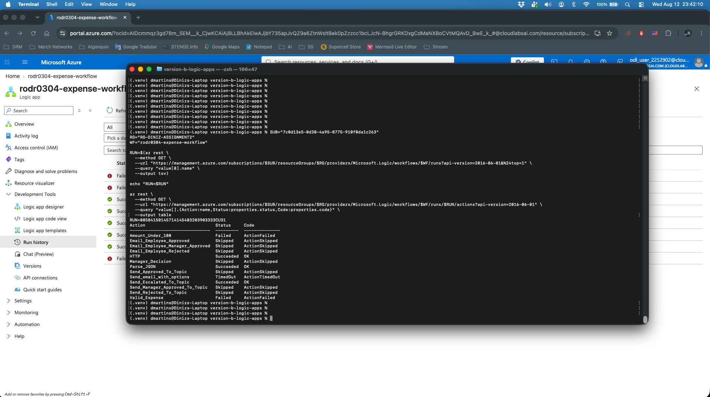

The employee receives the final escalation notification.

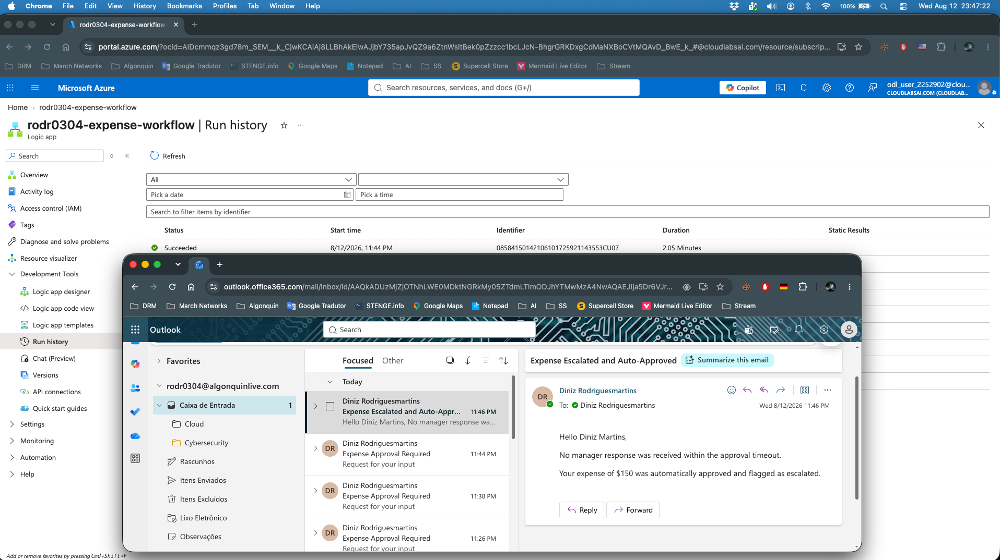

The email confirms that no manager response was received before the timeout and that the expense was automatically approved and flagged as escalated.

---

# 4. Comparison Analysis

## 4.1 Development Experience

The two implementations provided significantly different development experiences.

Durable Functions required more programming knowledge because the workflow was represented in Python. I had to understand the relationship between the HTTP starter, orchestrator, activities, external events, and durable timers. Initially, this required more effort than visually connecting Logic App actions. However, after the structure was working, the behavior became predictable because I could follow the complete business logic directly in code.

Logic Apps was faster for constructing straightforward integration steps. Service Bus integration, HTTP calls, conditions, and email actions can be represented visually. The designer made the overall business process easy to understand.

However, the timeout scenario demonstrated that visual orchestration does not necessarily mean that complex behavior is easier. The `Send email with options` action timed out as expected, but the parent conditions initially appeared as failed. I had to explicitly configure a path that executed when the action reached the `TimedOut` state and then terminate the workflow successfully.

Logic Apps was therefore faster for basic integration, while Durable Functions gave me more confidence when implementing complex orchestration behavior.

---

## 4.2 Testability

Durable Functions was easier to test locally.

I could run Azure Functions Core Tools and Azurite on my development machine and use HTTP requests to start an orchestration, retrieve its status, and submit a manager decision. This allowed the workflow scenarios to be reproduced without repeatedly interacting with the Azure Portal.

The HTTP-based interface also makes automated testing practical because requests and expected scenarios can be stored in `test-durable.http`.

Logic Apps testing depended more heavily on deployed Azure resources. Version B required Service Bus, the deployed Logic App, API connections, email integration, and the validation Azure Function to work together.

Manager approval testing also involved actual email interaction.

The Logic App Run History was extremely useful after each execution, but the overall testing process had more external dependencies than Durable Functions.

For local and automated testing, I preferred Durable Functions. For integration testing involving real Azure services and connectors, Logic Apps provided excellent visibility.

---

## 4.3 Error Handling

Durable Functions provided explicit programmatic control over application behavior.

Validation errors could be represented directly as orchestration results. The orchestrator could determine whether to continue processing, wait for an event, or finish with a validation result.

The timeout was also represented as part of the intended application logic rather than an unexpected infrastructure failure.

Logic Apps provides built-in action status tracking and `runAfter` configuration. Actions can execute based on whether previous actions succeeded, failed, were skipped, or timed out.

This became particularly important during implementation of the manager timeout.

The email approval action returned `TimedOut`. Without an explicit timeout path, parent actions were displayed as failed even though escalation was the expected business result.

I modified the workflow so that `Send_Escalated_To_Topic` executes specifically after `Send_email_with_options` reaches `TimedOut`. The workflow then sends the escalation notification and terminates successfully.

Logic Apps therefore provides powerful declarative failure handling, but action dependencies must be configured carefully.

---

## 4.4 Human Interaction Pattern

The Human Interaction requirement was the largest architectural difference between the implementations.

Durable Functions naturally supports Human Interaction using external events and durable timers.

The orchestrator can wait for a manager decision and a timer simultaneously. If the external event arrives first, the manager decision is processed. If the timer finishes first, the workflow follows the escalation path.

This approach maps directly to the business requirement.

Logic Apps required a different solution. I used the Microsoft 365 `Send email with options` action to send the approval request and wait for the response.

This approach is convenient because the manager can interact directly with the email, but the timeout behavior must be explicitly handled.

For the orchestration itself, Durable Functions provided the more natural implementation. Logic Apps, however, provided a convenient ready-made interface for the human participant through email.

---

## 4.5 Observability

Logic Apps provided the better visual monitoring experience.

Azure Portal Run History shows individual workflow executions, their duration, status, and the actions executed during each run.

This was particularly useful when debugging the timeout path because I could determine which actions succeeded, timed out, failed, or were skipped.

The visual workflow also makes the architecture easier to explain to someone who did not write the implementation.

Durable Functions provided detailed execution logs through Azure Functions Core Tools during local development. These logs showed orchestrator executions, activity calls, notifications, and status requests.

The logs were very useful for technical debugging, but understanding the complete workflow requires more familiarity with Durable Functions.

Both technologies provide useful observability, but I found Logic Apps easier for visual monitoring and Durable Functions more useful for detailed developer-oriented debugging.

---

## 4.6 Cost

The cost comparison depends on workload assumptions because Durable Functions and Logic Apps use different billing models.

For this comparison, I considered two approximate workloads:

- **100 expense requests per day**
- **10,000 expense requests per day**

At 100 expenses per day, both solutions operate at relatively low transaction volumes.

Durable Functions on a consumption-based Azure Functions architecture primarily generates costs from function executions, execution duration, and the storage operations required to maintain orchestration state.

Logic Apps Consumption charges according to workflow action and connector executions. Version B additionally uses Service Bus operations and an Azure Function for validation.

One business request can therefore generate several separate operations.

At 100 requests per day, this represents approximately 3,000 expense requests per month. At 10,000 requests per day, the workload increases to approximately 300,000 expense requests per month.

At the larger scale, the number of actions performed for every request becomes particularly important.

A Logic App execution may include queue processing, message parsing, validation, conditions, approval interaction, Service Bus publishing, and email notification. The number of billable operations can therefore grow substantially faster than the number of expense requests.

Durable Functions also generates multiple function executions and storage transactions for each orchestration, particularly when the workflow checkpoints its state or waits for external events.

The exact cost depends on the Azure region, Function execution duration, number of Logic App actions, connector types, Service Bus pricing tier, storage operations, and the percentage of expenses requiring manager approval.

For a production deployment, I would use the Azure Pricing Calculator with measured execution data from the application rather than assuming that the number of business requests alone represents the total cost.

The main lesson from the comparison is that serverless pricing must be evaluated according to the operations generated by each business transaction rather than only the number of incoming requests.

---

# 5. Recommendation

For a production implementation of this specific expense approval workflow, I would choose **Azure Durable Functions** if the workflow were expected to grow in complexity or become part of a larger custom application.

The primary reason is the Human Interaction requirement. Waiting for either a manager response or a timeout maps naturally to Durable Functions using an external event together with a durable timer. The orchestration logic is explicit in code, can be version controlled with the rest of the application, and can be exercised through HTTP-based automated tests.

Durable Functions would also be my preference when the development team is comfortable with Python and requires detailed control over branching, retries, error handling, and application-specific logic.

I would choose **Azure Logic Apps** when integration speed and operational visibility are more important than detailed programmatic control. Its visual workflow, Service Bus connectors, Microsoft 365 integration, and Run History make Logic Apps attractive for business processes involving existing Azure and Microsoft services.

This project demonstrated that Logic Apps can successfully implement the same approval workflow, including manager interaction and timeout escalation, but the timeout path required more explicit configuration than the Durable Functions implementation.

Therefore, my production recommendation for this workflow is Durable Functions, while Logic Apps would be a strong alternative for integration-heavy processes where built-in connectors and visual orchestration provide greater value.

---

# 6. Lessons Learned

The most important lesson from this assignment was that two serverless technologies can implement the same business requirement while requiring very different approaches.

Durable Functions made orchestration behavior explicit through code. External events and durable timers provided a natural implementation for manager approval and timeout handling.

Logic Apps initially appeared simpler because the workflow could be assembled visually. However, the timeout scenario showed that visual workflows still require a detailed understanding of execution states and dependencies.

A timeout can represent either a technical failure or a valid business event depending on how the workflow is configured.

I also learned the importance of observability. Logic App Run History made it possible to identify exactly which actions timed out and which subsequent actions were executed or skipped.

If I implemented this project again, I would design and test the timeout path earlier instead of leaving it until the final workflow tests.

---

# 7. Repository Structure

```text
.
├── README.md
├── version-a-durable-functions/
│   ├── function_app.py
│   ├── requirements.txt
│   ├── host.json
│   ├── local.settings.example.json
│   └── test-durable.http
├── version-b-logic-apps/
│   ├── function_app.py
│   ├── requirements.txt
│   ├── local.settings.example.json
│   └── test-expense.http
├── screenshots/
│   ├── version-a-auto-approved-under-100.png
│   ├── version-a-manager-approved.png
│   ├── version-a-manager-rejected.png
│   ├── version-a-timeout-waiting.png
│   ├── version-a-timeout-escalated.png
│   ├── version-a-validation-missing-field.png
│   ├── version-a-validation-invalid-category.png
│   ├── version-b-auto-approved-under-100.png
│   ├── version-b-manager-approval-request.png
│   ├── version-b-manager-approved.png
│   ├── version-b-manager-rejected.png
│   ├── version-b-manager-approval-options.png
│   ├── version-b-timeout-escalation-actions.png
│   └── version-b-timeout-escalated-email.png
└── presentation/
    ├── slides.pptx
    └── video-link.md
```

---

# 8. References

- Microsoft Learn — Azure Durable Functions Overview  
  https://learn.microsoft.com/azure/azure-functions/durable/durable-functions-overview

- Microsoft Learn — Durable Functions Human Interaction Pattern  
  https://learn.microsoft.com/azure/azure-functions/durable/durable-functions-overview#human

- Microsoft Learn — Azure Logic Apps Documentation  
  https://learn.microsoft.com/azure/logic-apps/

- Microsoft Learn — Azure Service Bus Documentation  
  https://learn.microsoft.com/azure/service-bus-messaging/

- Microsoft Learn — Azure Functions Documentation  
  https://learn.microsoft.com/azure/azure-functions/

- Microsoft Azure Pricing Calculator  
  https://azure.microsoft.com/pricing/calculator/

---

# 9. AI Disclosure

Generative AI tools were used during this assignment as a development and learning assistant.

AI assistance was used to help troubleshoot Azure configuration and workflow issues, explain Azure Durable Functions and Logic Apps concepts, review command-line output, organize testing evidence, and assist with documentation structure and wording.

All implementations were executed and tested by the student. Azure resources, workflow runs, manager approval interactions, timeout behavior, Service Bus integration, validation scenarios, and screenshots were manually verified during development.

The student reviewed the generated suggestions, executed the implementations, diagnosed deployment and runtime behavior, and validated the final results shown in this repository.
